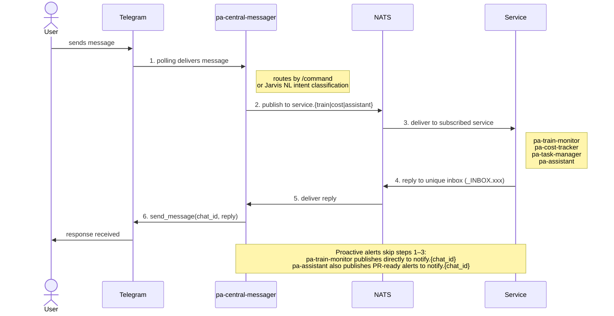

# Personal Assistant Platform

A modular, event-driven personal assistant controlled via Telegram. A central service receives all messages, routes them through a NATS message queue to the appropriate microservice, and relays responses back. Each service is independently deployable in its own Docker container. The whole stack starts with a single command.

---

## Architecture



Freeform messages are handled by **Jarvis** (`pa-assistant`), which uses a local Ollama LLM to parse intent and dispatch to the appropriate service — so you can say _"what trains are there from Stevenage to Kings Cross?"_ instead of typing `/train SVG KGX`.

Proactive train disruption alerts flow on a separate `notify.*` subject without going through the request/reply cycle.

---

## Repositories

| Repository | Role |
|---|---|
| [pa-infra](https://github.com/sneakybver-assistant/pa-infra) | Docker Compose stack, `.env`, `start.sh`, `deploy.sh` — the single entry point to run everything |
| [pa-central-messager](https://github.com/sneakybver-assistant/pa-central-messager) | Telegram polling, command routing, freeform → Jarvis, NATS gateway |
| [pa-train-monitor](https://github.com/sneakybver-assistant/pa-train-monitor) | UK National Rail live departures (Realtime Trains API), background disruption monitoring with proactive alerts |
| [pa-cost-tracker](https://github.com/sneakybver-assistant/pa-cost-tracker) | Credit/debit card transaction recording, 30-day spend summaries, LLM-powered analysis |
| [pa-task-manager](https://github.com/sneakybver-assistant/pa-task-manager) | Personal task management — add, list, search, complete, and delete tasks with due dates and priorities |
| [pa-assistant](https://github.com/sneakybver-assistant/pa-assistant) | Jarvis — freeform NL interface backed by a local Ollama model; dispatches to other services transparently; manages service containers via `/restart` and `/logs` |
| [pa-build-agent](https://github.com/sneakybver-assistant/pa-build-agent) | Autonomous multi-repo coding agent — runs a Claude agentic loop on `/build` requests; reads/writes files across repos, commits, pushes, and opens PRs; sends threaded Telegram updates throughout |

---

## Quick Start

**Prerequisites:** Docker, all six repos cloned as siblings, an [Ollama](https://ollama.com) instance running (local or remote).

```bash
git clone https://github.com/sneakybver-assistant/pa-infra
git clone https://github.com/sneakybver-assistant/pa-central-messager
git clone https://github.com/sneakybver-assistant/pa-train-monitor
git clone https://github.com/sneakybver-assistant/pa-cost-tracker
git clone https://github.com/sneakybver-assistant/pa-task-manager
git clone https://github.com/sneakybver-assistant/pa-assistant
git clone https://github.com/sneakybver-assistant/pa-build-agent

cd pa-infra
./start.sh        # creates .env on first run — fill in credentials, then run again
```

**Deploy to Raspberry Pi:**
```bash
cd pa-infra
./deploy.sh pi@raspberrypi.local
```

---

## Commands

| Command | Routes to | Example |
|---|---|---|
| `/train [from] [to]` | pa-train-monitor | `/train SVG KGX` |
| `/monitor [from] [to] [HH:MM] [days?]` | pa-train-monitor | `/monitor SVG KGX 18:09 weekdays` |
| `/unmonitor [from] [to]` or `all` | pa-train-monitor | `/unmonitor all` |
| `/monitors` | pa-train-monitor | `/monitors` |
| `/cost [description]` | pa-cost-tracker | `/cost Waitrose £42.50` |
| `/spend` | pa-cost-tracker | `/spend` |
| `/analyse` | pa-cost-tracker | `/analyse` |
| `/task [description]` | pa-task-manager | `/task File taxes 2026-04-30 high` |
| `/tasks [filter?]` | pa-task-manager | `/tasks today` |
| `/donetask [id]` | pa-task-manager | `/donetask 3` |
| `/deltask [id]` | pa-task-manager | `/deltask 5` |
| `/searchtask [query]` | pa-task-manager | `/searchtask dentist` |
| `/ask [question]` | pa-assistant | `/ask what is inflation?` |
| `/build [description]` | pa-build-agent | `/build add a /health endpoint to all services` |
| `/restart [service]` | pa-assistant | `/restart pa-train-monitor` |
| `/logs [service]` | pa-assistant | `/logs pa-cost-tracker` |
| `/help` | handled locally | `/help` |
| Freeform text | Jarvis → auto-routes | `what trains are from Stevenage today?` |

---

## Tech Stack

| Component | Technology | Reason |
|---|---|---|
| Message queue | NATS | Sub-10 MB binary, ARM64 native, request/reply with unique inboxes |
| Language | Python 3.12 | Async, strong NATS and Telegram libraries |
| Database | SQLite | Zero-config, file-based, sufficient for personal scale |
| Containers | Docker + Compose | Runs identically on Mac and Raspberry Pi (ARM64) |
| LLM | Ollama (local) | Private, offline-capable, configurable host |
| Train data | Realtime Trains API v2 | Live UK National Rail departures and disruptions |
